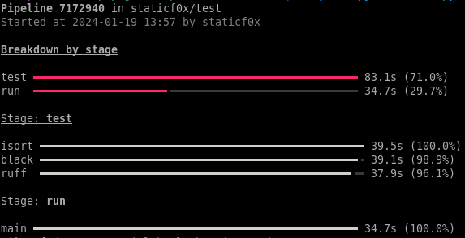

# gitlab-plumber

GitLab plumber is a small utility that helps you analyze the duration
of GitLab pipelines.

## Running

### Show a tree of jobs

`$ poetry run python3 main.py show --project <PROJECT_ID> --pipeline <PIPELINE_ID>`


This shows the queue time + run time for each job as well as percentage of the
stage duration. For stages, it shows the total runtime and percentage of the
whole pipeline duration.

### Show a blame graph of stages and individual jobs

`$ poetry run python3 main.py blame --project <PROJECT_ID> --pipeline <PIPELINE_ID>`



This shows the stages and jobs sorted by total run duration (queue is excluded)
to narrow down which of the stages/jobs take the longest.

### Show or blame by URL

Instead of passing project ID and pipeline ID it is possible to pass the direct URL
to a pipeline:

`$ poetry run python3 main.py show --url https://gitlab.com/group/project/-/pipelines/123456`

## Installation

- `$ poetry install --no-root`

## Configuration

Create `.env` file with the following content:

```
GITLAB_URI=<GitLab instance URL>
PRIVATE_TOKEN=<Your private token>
```
